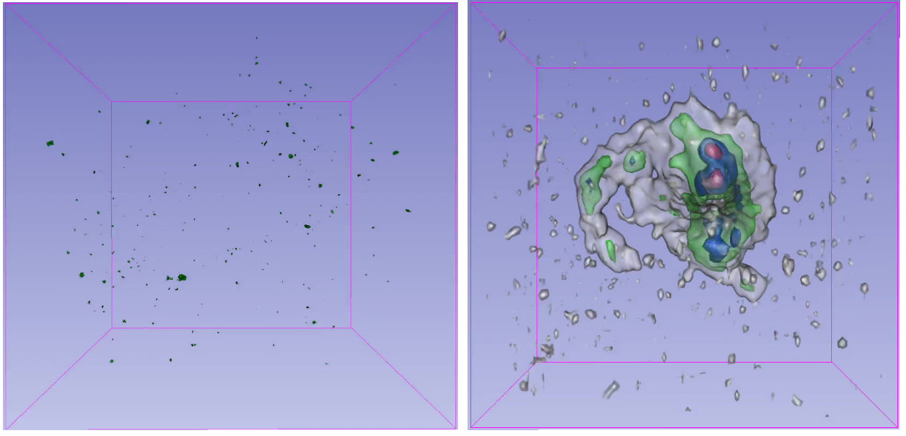

# Source finding/ object segmentation in HI 3D data cubes

Credit: D. Punzo et al. (2015)
## Project Description
Astronomical surveys map the skies without a specific target, resulting in images containing manyastronomical objects. As the technology used to create these surveys improves with projects likethe SKA, an unprecedented amount of data will become available. Besides the time that itwould require, manually detecting sources in data-sets of this volume would be unfeasible due tothe low intensities of many sources, increasing their proximity to the level of noise. Hence the needfor fast and accurate techniques to detect and locate sources in astronomical survey data.

The problem at hand can be seen as an overlap between fields, where existing advances in computervision could be used to solve the struggle of source finding in astronomy. In computer vision objectrecognition encompasses a collection of tasks, including object segmentation, which we will referto as source finding in this paper. Object segmentation can be defined as drawing a mask aroundidentified objects in an image and assigning them class labels. This is done by highlighting pixels(or voxels in the case of 3D data cubes) belonging to different objects such as astronomical sourcesand noise or background.

The challenge lies in the lack of clarity in the boundaries of sources, with many having inten-sities very close to the noise, especially in the case of radio data. Additionally, as the sensitivityand depth in astronomical surveys will increase, so will the number of overlapping sources asfainter and more extended sources are observed. This concept is known as blending. Having thisforesight, many astronomers have explored source finding and deblending solutions using simplestatistical techniques. However, these approaches are very sensitive to the input parameters andhave been found to struggle with differentiating between faint sources and noise, resulting in atrade-off between accepting false sources and excluding true sources. While object segmentationin 2D images is considered a “solved” problem these days, the same task in 3D data cubes is stillvery new and unexplored in both astronomy and computer vision. In this paper we will explorethe various existing methods, including the traditional statistical approaches as well as machinelearning techniques in attempt to create a pipeline to optimally mask and label the sources in 3Dneutral hydrogen (HI) data cubes.

### References:
D. Punzo, J. M. van der Hulst, J. B. T. M. Roerdink, T. A. Oosterloo, M. Ramatsoku, andM. A. W. Verheijen. The role of 3-d interactive visualization in blind surveys of hi in galaxies,2015